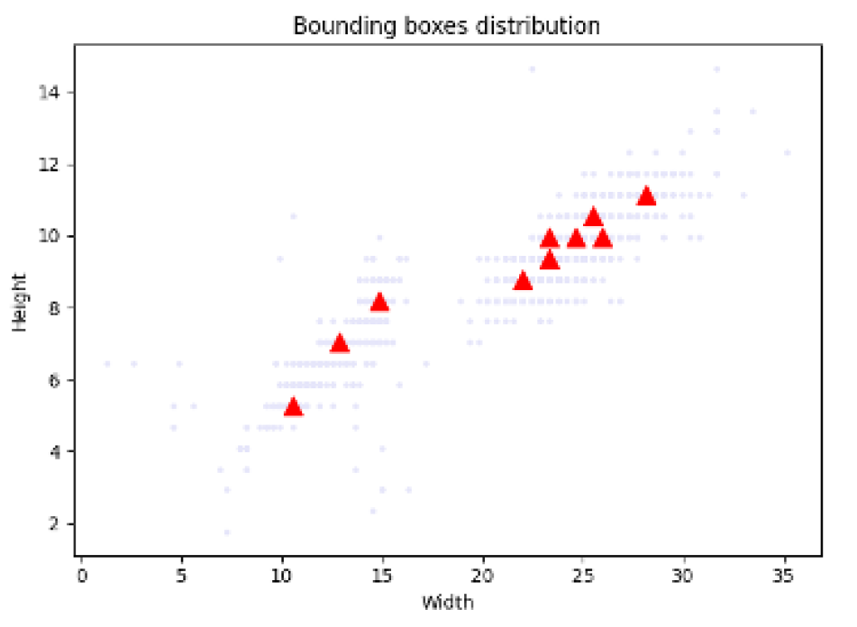
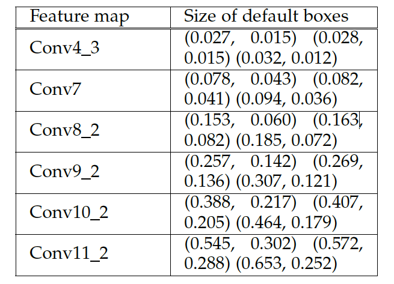

# License-Plate-Localisation-Recognition

This project showcases a license plate localisation and recognition, utilizing the power of [OpenVINO](https://docs.openvinotoolkit.org/) framework.

License plates localisation and recognition in a real-life scene: 

## Building

### Dependencies
1. [OpenVINO](https://software.intel.com/content/www/us/en/develop/tools/openvino-toolkit.html): OpenVINO is a toolkit for quickly developing computer vision applications which based on Convolution Neural Networks(CNNs), and it is hassle-free to optimize performance across platforms by utilize OpenVINO.
2. [MobileNet-SSD](https://github.com/tensorflow/models/blob/archive/research/object_detection/g3doc/tf1_detection_zoo.md): We choosed TensorFlow implementation of MobileNet-SSD to detect license plates, and train it on [BIT-Vehicle](http://iitlab.bit.edu.cn/mcislab/vehicledb/) dataset.
3. [LPRNet](https://arxiv.org/pdf/1806.10447.pdf): We use a pre-trained LRPNet which combine character segmentation and recognition in one inference, and it is trained on a private Chinese license plate dataset.
4. [OpenCV](https://opencv.org/): We use C++ version OpenCV to capture videos from a webcam and parse video frames and then fill into CNN models via OpenVINO APIs.

### Environment Files
1. license_plate_localisation_recognition: Can be executed it directly in command line using "./license_plate_localisation_recognition".
2. lib folder: Dependencies lib files.
3. LPL.xml and LPL.bin: Network Model for license plate localisation, have been converted to proprietary OpenVINO format using [Model Optimizer](https://docs.openvinotoolkit.org/latest/_docs_MO_DG_Deep_Learning_Model_Optimizer_DevGuide.html).
3. LPR.xml and LPR.bin: Network Model for license plate recognition, have been converted to proprietary OpenVINO format using [Model Optimizer](https://docs.openvinotoolkit.org/latest/_docs_MO_DG_Deep_Learning_Model_Optimizer_DevGuide.html).
4. main.cpp: Main Source code of this project, use the [CMakeLists.txt](CMakeLists.txt) to build executable file.

### Train && Build
We follow this [tutorial](https://github.com/opencv/openvino_training_extensions/tree/develop/tensorflow_toolkit/ssd_detector) to train the MobileNet-SSD model. However, unlike this tutorial, we detect license plate directly without vehicles. 
First, we need to use [BIT_to_COCO.py](https://github.com/MaYatKit/License-Plate-Localisation-Recognition/blob/master/BIT_to_COCO.py) to convert annotations of BIT-Vehicle from JSON to COCO xml format; Then we utilize K-Mean algorithm to cluster the bounding boxes of the BIT-Vehicle dataset to find 10 width/height ratios, which is [cluster_bounding_box.py ](https://github.com/MaYatKit/License-Plate-Localisation-Recognition/blob/master/cluster_bounding_box.py), and we got the following result: 
 
Then we choose three scales instead of five which in the [SSD paper](https://arxiv.org/abs/1512.02325) because we only need to detect license plates and less default boxes can reduce training time and inference time. Default boxes for each SSD layer are the following: 
 
Other parameters we follow the [tutorial](https://github.com/opencv/openvino_training_extensions/tree/develop/tensorflow_toolkit/ssd_detector) 

### Future Work
We plan to train the MobileNet-SSD and LPRNet on multiple license plate dataset to obtain more generalization.

